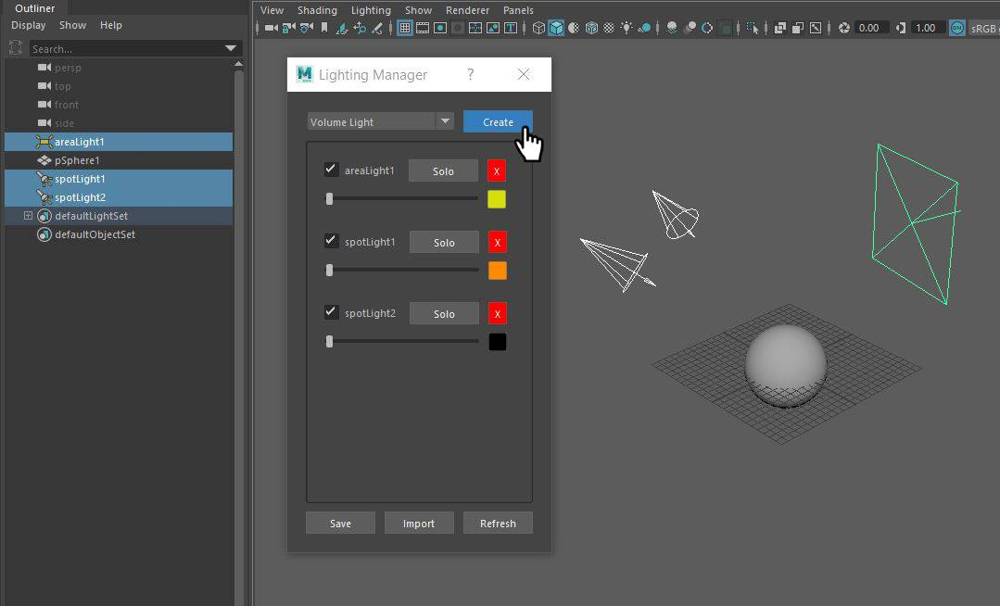
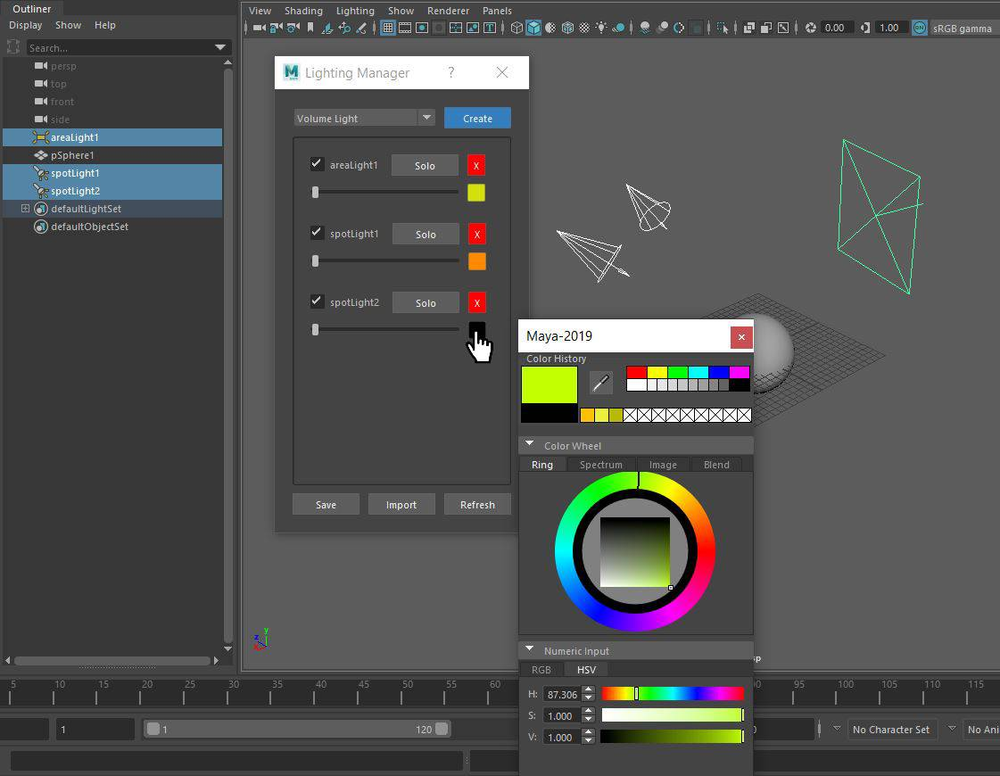
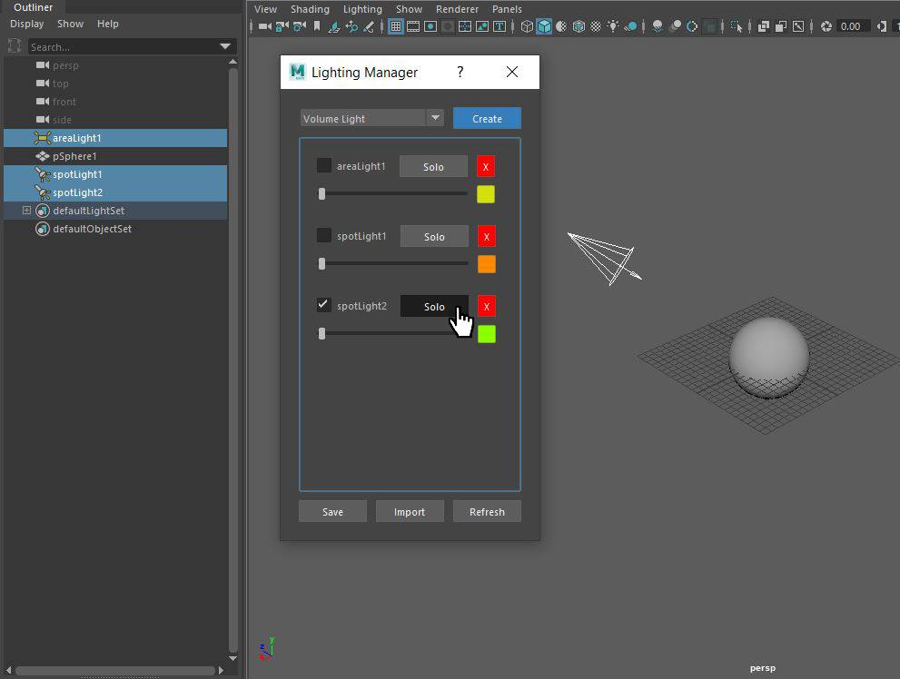

## Lighting-Manager
## Summary
The Lighting manager lets it’s user manage light, intensity and color. Allows ease of checking on and off lights as well as option to solo specific lights. Clicking the refresh button will allow manager to update itself on any lights you may have added through Mayas traditional interface. Manager remembers not just the settings but also the locations of your lights and allows the user to save a reload their lighting setups.
 

When clicking the color box, Mayas color picker interface opens up.

Clicking the Solo button, isolates the light by turning off all other lights.

Clicking the Save button saves to a created folder in the Maya directory. 
The import button allows you to load saved lighting configurations. 

