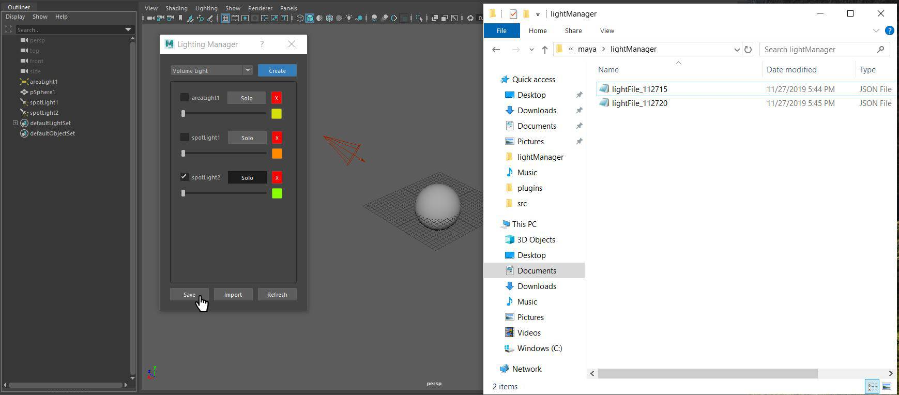

## Lighting-Manager
## Summary
The Lighting manager lets it’s user manage light, location, intensity and color. User can check on and off lights as well as solo specific lights. Clicking the refresh button will tell the manager to search for any new lights you added through Mayas traditional interface. You can also Save and load lighting setups in JSON format.
## Tools
 - Python 
 - PyMEL
## How It Works

When clicking the color box, Mayas color picker interface opens up.

Clicking the Solo button, isolates the light by turning off all other lights.

Clicking the Save button, saves the users light setup to an auto generated folder named "LightingManager" in the Maya directory. 
The import button allows you to load sellected lighting configurations. 

